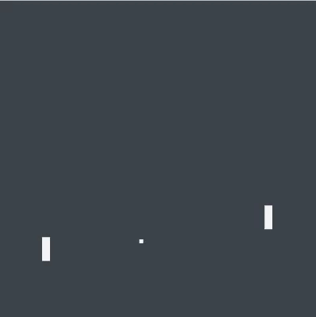

# Tetris IA

## Solução

O bot consiste em uma rede neural treinada com aprendizagem por reforço. A cada passo feito pelo bot é retornado uma recompensa (+1 caso rebata a bola, -1 caso perca um ponto e 0 caso contrário). Essas recompensas, junto com os estados do jogo e a ação tomada, são armazenados em uma buffer prioritario (maiores error tem maior prioridade). A cada passo um conjunto de ações passadas são usadas para treinar a rede neural. 

A rede é treinada com base na diferença da resposta obtida (resposta da rede para o estado atual) e a resposta esperada (recompensa obtida + parte da recompensa esperada para o estado futuro). A recompensa esperada é obtida através de um outro modelo que é atualizado após alguns passos, isso fornece mais estabilidade.

A resposta da rede neural é obtida através de duas saídas. Uma saída é um valor único, que representa o valor do estado. A outra saída é do tamanho do vetor de ações, representa o valor de cada ação. Isso facilita o modelo a avaliar o estado atual e as ações de forma separada. 

